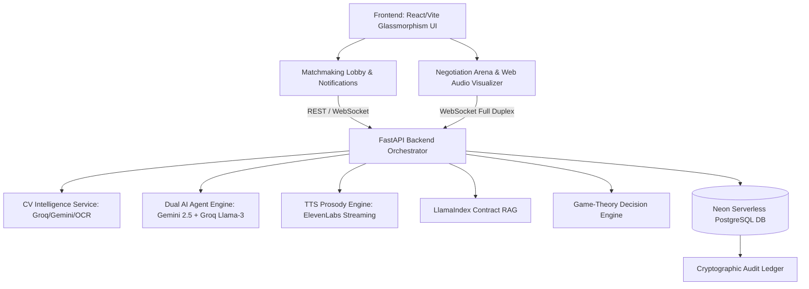

<div align="center">
  
  <h1>🏛️ DealRoom</h1>
  <p><b>Autonomous Multi-Agent AI Voice Negotiation Platform</b></p>
  
  [](https://deal-room-orpin.vercel.app)
  [](https://dealroom-backend-rvdv.onrender.com)
  [](https://react.dev)
  [](https://fastapi.tiangolo.com)
  [](https://ai.google.dev)
  [](https://groq.com)
</div>

<br/>

## 1. Project Overview — What We Built

**DealRoom** is a full-stack, AI-powered real-time voice negotiation platform designed to eliminate the friction, stress, and inefficiency of freelancer-client price negotiations. Rather than spending days or weeks negotiating via text messages or emails, DealRoom deploys **two autonomous AI agents** — one representing the Freelancer and one representing the Client — that negotiate verbally in real-time using synthesized speech, game theory, and deep project knowledge.

The platform operates across two core phases:
1. **Matchmaking Lobby** — Freelancers and Clients register their profiles (skills, JD, budget) and are matched with each other using a live AI scoring engine.
2. **AI Deal Room** — Once matched, both parties enter a private AI-mediated negotiation room where their AI agents conduct a live voice-based negotiation, converging to a Pareto-optimal price agreement, and auto-generating a legally structured Statement of Work (SOW).

### The Problem We Solve
Freelancers and clients today waste **dozens of hours** trapped in drawn-out, high-anxiety price negotiations over text. The outcome often fails both parties — freelancers undersell their skills or accept bad terms, while clients overpay or hire the wrong talent. DealRoom solves this by:
- Deploying AI agents that negotiate on behalf of both parties based on their actual skills, CV, budget, and job requirements.
- Running a multi-turn voice debate that explores the project technically before reaching a commercial agreement.
- Auto-generating binding Statements of Work upon deal close.

---

## 2. Key Features

### 🧠 Intelligent Matchmaking Lobby
Freelancers and Clients register their profiles. Freelancers can upload their CVs (parsed via Gemini Vision and Llama-3). Clients paste their Job Descriptions. The system computes a live **AI Match Score** (0–100%) based on skill and project overlap. Both lobbies are connected via a persistent WebSocket for instant Deal Call requests.

### 🤖 Dual AI Agent Negotiation Engine
Two LLMs negotiate live. **Agent A (Freelancer)** is powered by **Google Gemini 2.5 Flash**. **Agent B (Client)** is powered by **Groq Llama-3.3-70b**. The agents follow an executive protocol to discuss technical roadmap first, commercial milestones second, and converge to a Nash Equilibrium price without premature deadlocking.

### 🤫 Secret Whisper Human Override
A real-time human supervision mechanism that allows either the Freelancer or Client to privately "whisper" a secret instruction to their AI agent mid-negotiation using their microphone (Web Speech API). The backend injects the whisper into the next turn as a CRITICAL OVERRIDE.

### 🎙️ Dynamic TTS & Acoustic Telemetry
Features an ElevenLabs streaming text-to-speech engine with vocal prosody modulation (speaking rate speeds up near closing). An acoustic telemetry engine detects Vocal Conviction, Bluff Probability, and Hesitation from the dialogue text.

### 📝 LlamaIndex RAG & Auto-Contract Generation
Grounds the negotiation in semantic contract clauses. Once an agreement is reached, it auto-generates a structured Upwork-style **Statement of Work (SOW)** and an Enterprise-grade **Master Services Agreement (MSA)**.

### 🔔 Mobile & Desktop Notification Engine
Real-time, cross-platform push notifications (HTML5 API) combined with synthesized Web Audio API chimes ensure users instantly know when a deal call is requested, accepted, or declined.

---

## 3. Architecture Overview



---

## 4. How to Run Locally

### Backend
```bash
cd backend
python3 -m venv venv
source venv/bin/activate
pip install -r requirements.txt

# Set environment variables in .env:
# GEMINI_API_KEY=...
# GROQ_API_KEY=...
# ELEVENLABS_API_KEY=...
# DATABASE_URL=...   (Neon PostgreSQL connection string)

uvicorn main:app --port 10000 --reload
```

### Frontend
```bash
cd frontend
npm install
npm run dev
# Opens at http://localhost:5173
```

---

## 5. Live Demo Instructions

1. **Visit** [https://deal-room-orpin.vercel.app](https://deal-room-orpin.vercel.app)
2. **Freelancer Flow (Tab 1):** Click "I'm a Freelancer", upload your CV or enter skills, and wait in the Lobby.
3. **Client Flow (Tab 2 / Different device):** Click "I'm a Client", paste an Upwork job description, see matched freelancers, and click "📞 Send Deal Invite".
4. **Negotiation:** Both parties receive a notification. Freelancer accepts, and both enter the AI Deal Room.
5. Watch the AI agents negotiate by voice. Use the **Whisper** microphone button to override your agent mid-negotiation.
6. **Closing:** Once agreed, the SOW and MSA are generated.

---

*Built for the AI Hackathon · DealRoom v3.0.0*
